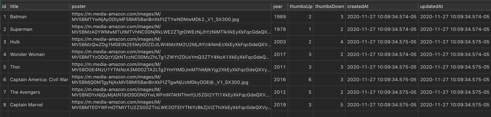
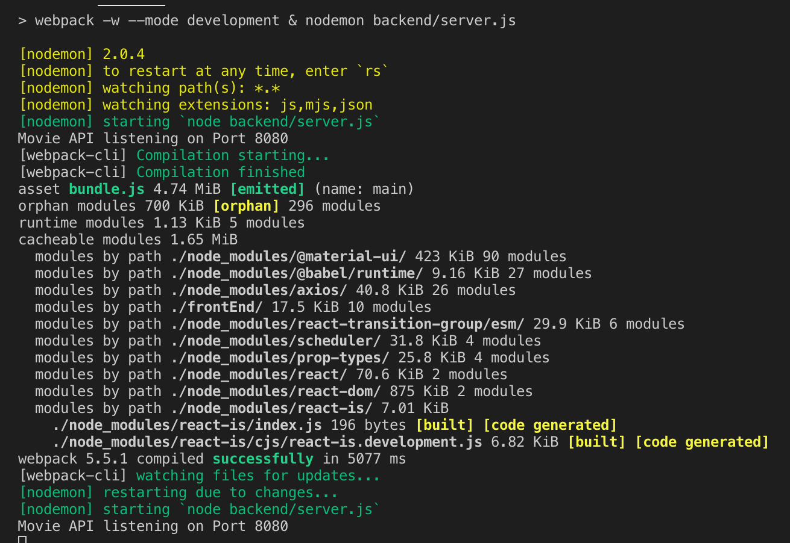

## Movie Search

#### Built with Postgres, Express, Sequelize, React, Material-UI, Axios, Immer, Babel, and Webpack
 

### See App in use [here](https://youtu.be/2KYGhw3FxYo)

 

###  To run you must have node, nodemon and postgres installed

   - run `createdb moviesdb` to initialize the db
   - run `npm run seed` to seed the db you just made
     - the db will look like this:
 <h1 align="center">
	
	 
</h1>

   - run `npm start` to compile the app with Webpack and initialize the server

### When the server is running you will see:

<h1 align="center">
	
	 
</h1>

   - the app is now running at [port: 8080](http://localhost:8080/)
 
 

